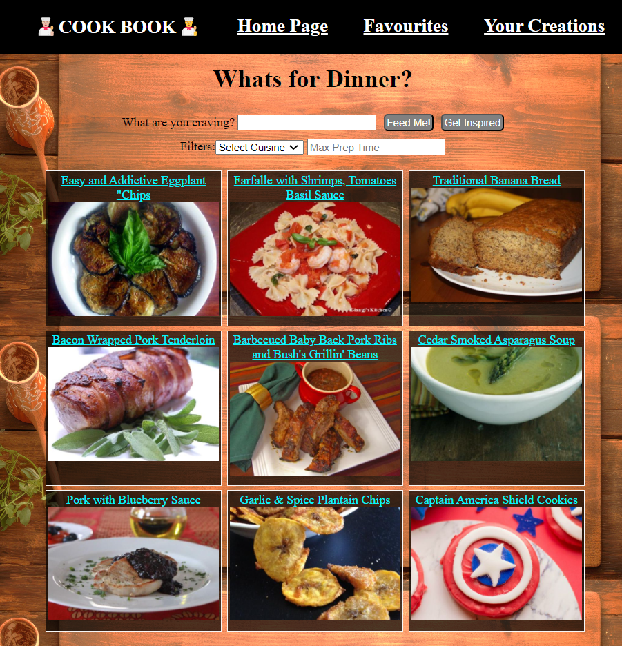
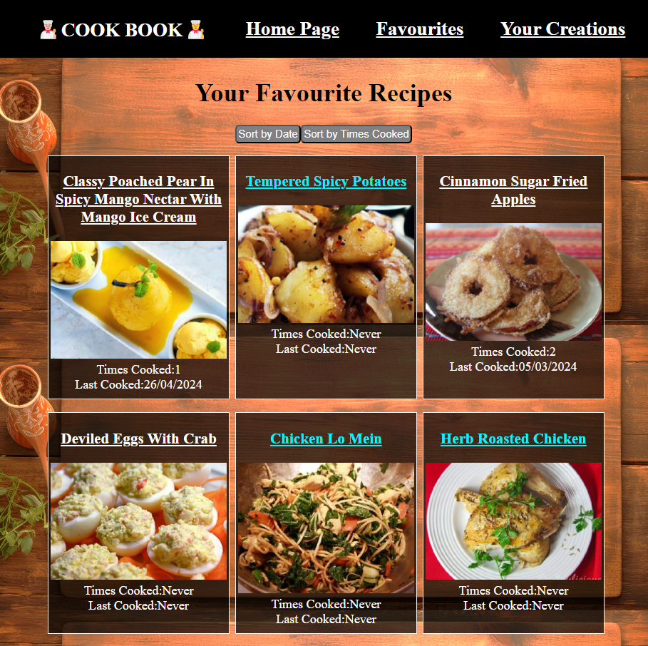
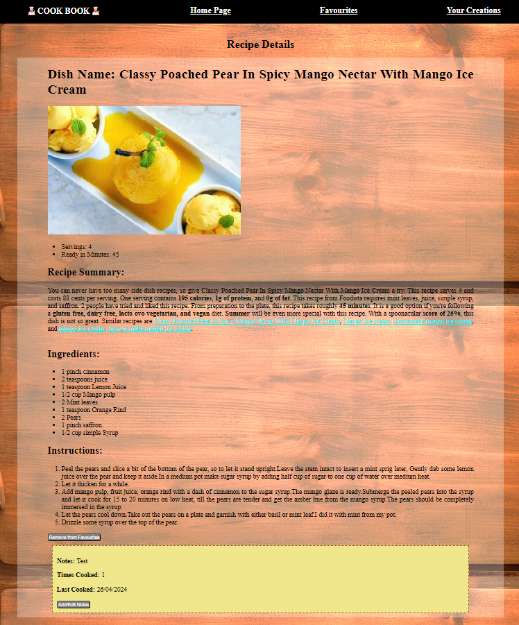
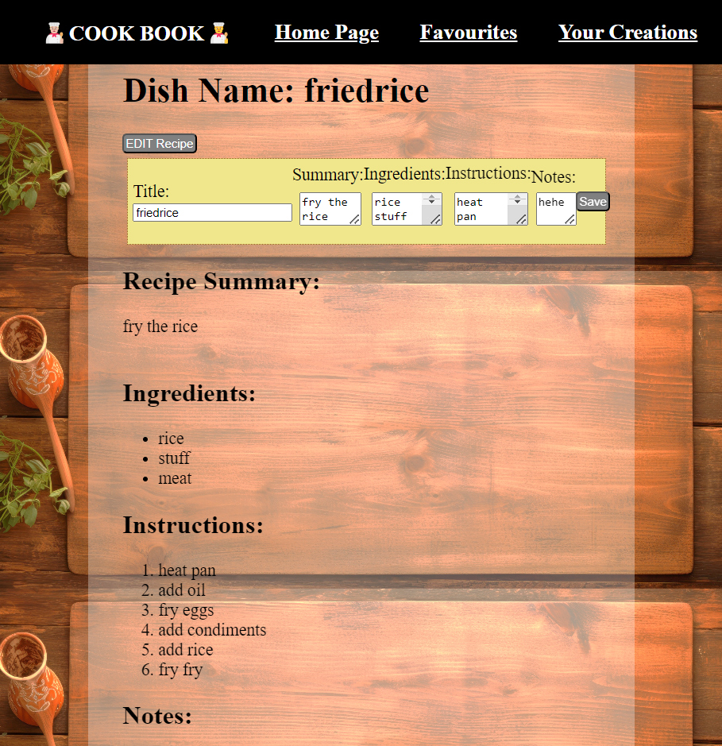

# Project2 Cookbook

**Whats for Dinner?!!?!?!!?!!?!**

This cookbook allows users to search for new recipes online/get inspired with random recipes; and add them to their favourites.

Later (after trying the recipe), users can also add notes to these recipes to suit their preferences, and sort by the number of times they have cooked this, or the last time they have cooked it.

As an additional feature, users can also add their own recipes in and edit them along the way.

Giving you a cookbook that could help to expand your repertoire of dishes.

## Links

- PlanningBoard: https://trello.com/b/YTyXgWkq/ga-project2
- Deployed on Vercel: https://cookbook-ten-ochre.vercel.app

## Screenshots

## References and Technologies Used

- React
- Vite
- JS
- CSS
- Bruno
- Airtable
- API from Spoonacular

## Incomplete

- URL to change with search query (useParams)
- Input text with rows pre-formatted for lists
- Photos Uploading (require server)
